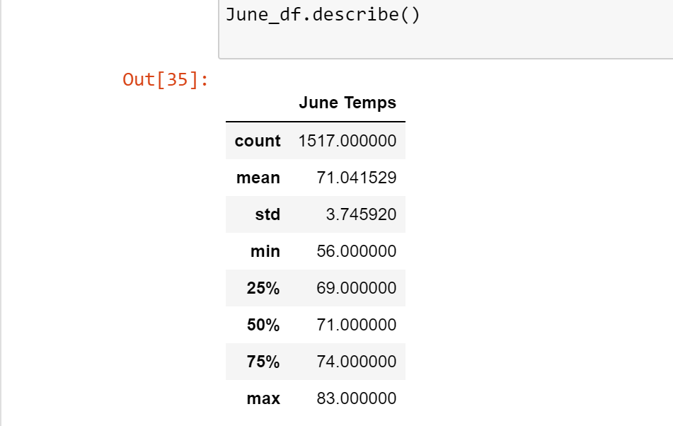

# surfs_up

### Overview of Analysis

The purpose of this analysis is to use Python, Jupyter Notebook and SQLAlchemy to filter out data from the "hawaii.sqlite" file. The analysis will filter out specific months and examine the temperatures that occur during that month. We can then compare temperature data for the months of June and December in Oahu, in order to determine if the surf and ice cream shop business is sustainable year-round.

### Results

### Summary
