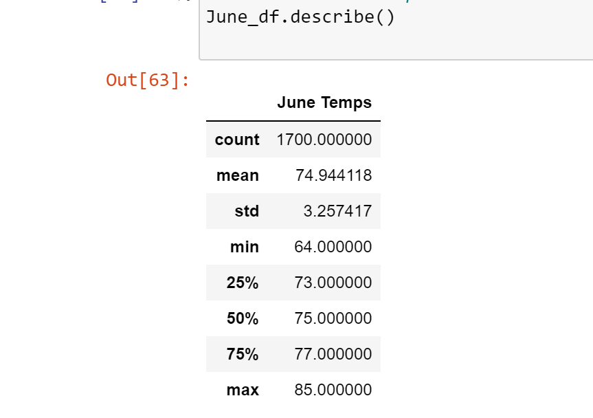

# surfs_up

### Overview of Analysis

The purpose of this analysis is to use Python, Jupyter Notebook and SQLAlchemy to filter out data from the "hawaii.sqlite" file. The analysis will filter out specific months and examine the temperatures that occur during that month. We can then compare temperature data for the months of June and December in Oahu, in order to determine if the surf and ice cream shop business is sustainable year-round.

### Results

- The max temperature in June is 85 degrees while the max temperature in December is 83 degrees.
- The min temperature in June is 64 degrees while the min temperature in December is 56 degrees.
- The average temperature in June is 74.9 degrees while the average temperature in December is 71.0 degrees. 

### Summary

From the analysis, we can state that the temperatures in Oahu during June and December are similar, with both having average temperatures in the 70s. Based solely on this information, it can be determined that the surf and ice cream shop will perform similarly in both months. However, other variables may affect the business. Further analysis/query on other factors such as precipitation or humidity is recommended. 
